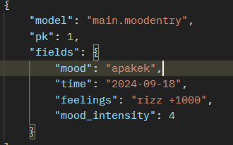

# URL PWS: http://muhammad-yahya32-sigmart.pbp.cs.ui.ac.id/

## Tugas 2
### Bagaimana step by step saya mengerjakan tugas ini.
##### 1.  Membuat sebuah proyek Django baru.
Saya membuat direktori baru sebagai basis untuk aplikasi Django.

##### 2. Membuat aplikasi dengan nama main pada proyek tersebut.
Dalam direktori utama, saya menginisiasi app bernama main dengan python manage.py startapp main.

##### 3. Melakukan routing pada proyek agar dapat menjalankan aplikasi main.
Dengan import path dan main, lalu menambahkan 'main' ke urls.py pada direktori main (bukan root folder) serta menambahkan path ke main.

##### 4. Membuat model pada aplikasi main dengan nama product dan memiliki atribut wajib nama, harga, dan deskripsi.
Yaitu dengan menggunakan models. Saya memberi nama class add_item_entry untuk menambahkan item di e-commerce. Models tersebut saya assign dengan atribut nama, deskripsi, harga, dan tipe.

##### 5. Membuat sebuah fungsi pada views.py untuk dikembalikan ke dalam sebuah template HTML yang menampilkan nama aplikasi serta nama dan kelas kamu.
Dengan menginisiasi variabel context, saya bisa menampilkan informasi yang saya unggah di dictionary context dengan me-return render(request, "main.html", context) dari fungsi show_main.

##### 6. Membuat sebuah routing pada urls.py aplikasi main untuk memetakan fungsi yang telah dibuat pada views.py.
Dengan menambahkan path path('', include('main.urls')) pada urls.py direktori root.

##### 7. Melakukan deployment ke PWS terhadap aplikasi yang sudah dibuat sehingga nantinya dapat diakses oleh teman-temanmu melalui Internet.
Dengan menggunakan git add, commit, push ke PWS dengan command yang sudah diberikan pada PWS.

### Buatlah bagan yang berisi request client ke web aplikasi berbasis Django beserta responnya dan jelaskan pada bagan tersebut kaitan antara urls.py, views.py, models.py, dan berkas html.

### Jelaskan fungsi git dalam pengembangan perangkat lunak!
Git merupakan sistem yang berfungsi sebagai version control. Version control secara singkat adalah sistem yang memudahkan pengembang perangkat lunak untuk melacak perubahan yang terjadi dalam kodenya serta dapat kembali ke versi kode yang diinginkan jika terjadi kesalahan dalam pengembangan.

### Menurut Anda, dari semua framework yang ada, mengapa framework Django dijadikan permulaan pembelajaran pengembangan perangkat lunak?
Karena Django merupakan framework yang sederhana dalam penggunaannya dan memprovide banyak fitur yang memudahkan web developer pemula dalam membuat website. Misalnya, Django menyediakan manajemen URL dan routing, serta model ORM yang sederhana. Selain itu, framework MTV Django melatih web developer untuk melakukan best practice dalam web development, dengan memisahkan logika data (backend), logika tampilan website, dan alur kerja website yang dibuat. Alasan lainnya adalah karena Django memiliki dokumentasi yang lengkap yang memudahkan pemula untuk membangun web pertamanya. Django juga dilengkapi dengan keamanan bawaan untuk menghalau serangan siber yang sering terjadi lewat website.

### Mengapa model pada Django disebut sebagai ORM?
Model pada Django disebut sebagai ORM (Object-Relational Mapping) karena Django menggunakan pendekatan ini untuk menghubungkan objek-objek di aplikasi Python dengan tabel-tabel di database. ORM memungkinkan developer bekerja dengan database menggunakan kode Python tanpa harus menulis query SQL secara langsung. Setiap model Django mewakili sebuah tabel dalam database, dan setiap atribut pada model mewakili kolom dalam tabel tersebut. Dengan ORM, kita dapat melakukan operasi seperti membaca, menulis, memperbarui, atau menghapus data di database hanya dengan menggunakan metode dan objek Python, sehingga mempermudah integrasi antara kode aplikasi dan sistem manajemen database (DBMS).

## Tugas 3:
### Jelaskan mengapa kita memerlukan data delivery dalam pengimplementasian sebuah platform?

Dalam pengembangan platform, data delivery sangat penting karena memungkinkan pertukaran informasi antara berbagai komponen sistem, baik itu antara server dan klien maupun antar layanan dalam sistem yang kompleks. Tanpa mekanisme pengiriman data yang efisien, platform tidak bisa berfungsi dengan baik, terutama ketika pengguna membutuhkan informasi secara real-time. Data delivery memastikan bahwa data dikirim, diterima, dan diproses dengan cepat dan aman sehingga platform dapat memberikan pengalaman yang mulus bagi penggunanya.

### Menurutmu, mana yang lebih baik antara XML dan JSON? Mengapa JSON lebih populer dibandingkan XML?

JSON dianggap lebih baik dibandingkan XML dalam banyak situasi modern karena JSON lebih ringan, lebih mudah dibaca oleh manusia, dan lebih mudah diuraikan oleh mesin. JSON menggunakan lebih sedikit karakter dan tidak memerlukan tag penutup yang rumit seperti XML, sehingga lebih efisien dalam hal penyimpanan dan transmisi data. Selain itu, karena JSON adalah format native untuk JavaScript, JSON sangat cocok untuk aplikasi web modern. XML masih digunakan di beberapa domain seperti sistem warisan atau dokumen kompleks, tetapi popularitas JSON meningkat karena kesederhanaan dan kompatibilitas yang lebih baik dengan teknologi web saat ini.

### Jelaskan fungsi dari method is_valid() pada form Django dan mengapa kita membutuhkan method tersebut?

Method is_valid() pada form Django digunakan untuk memeriksa apakah data yang diinput ke dalam form sudah sesuai dengan aturan validasi yang telah ditentukan. Jika data valid, method ini akan mengembalikan nilai True dan form akan menyimpan data yang sudah dibersihkan (cleaned data). Kita memerlukan method ini agar form bisa memproses data yang sesuai standar sebelum disimpan ke database atau digunakan lebih lanjut, menghindari kesalahan atau serangan yang mungkin terjadi akibat input yang tidak valid atau berbahaya.

### Mengapa kita membutuhkan csrf_token saat membuat form di Django? Apa yang dapat terjadi jika kita tidak menambahkan csrf_token pada form Django? Bagaimana hal tersebut dapat dimanfaatkan oleh penyerang?

csrf_token dibutuhkan pada form di Django untuk mencegah serangan CSRF (Cross-Site Request Forgery), di mana penyerang dapat mengirimkan permintaan berbahaya yang tampak seperti berasal dari pengguna sah. Jika kita tidak menambahkan csrf_token, form kita menjadi rentan terhadap serangan ini, di mana penyerang bisa memanfaatkan kelemahan tersebut untuk mengakses atau memanipulasi data sensitif tanpa sepengetahuan pengguna. Dengan menambahkan csrf_token, server memastikan bahwa setiap permintaan form benar-benar berasal dari pengguna yang mengakses situs secara sah.

### Jelaskan bagaimana cara kamu mengimplementasikan checklist di atas secara step-by-step (bukan hanya sekadar mengikuti tutorial).
Saya mainly menggunakan kode yang ada di tutorial, namun dengan beberapa modifikasi terutama pada forms.py, views.py, dan create_mood_entry.html saya ubah menjadi tombol form untuk menambahkan item pada marketplace yang saya buat. Dengan variabel item_name, description, serta price. Perubahan ini dilakukan pada forms.py dengan mengubah nama class serta list "fields". Lalu views.py disesuaikan dengan fields yang saya ubah serta nama class form tersebut. 

### Mengakses keempat URL di poin 2 menggunakan Postman, membuat screenshot dari hasil akses URL pada Postman, dan menambahkannya ke dalam README.md.

## Tugas 4

### Apa itu Django UserCreationForm, dan jelaskan apa kelebihan dan kekurangannya?
Django UserCreationForm adalah form bawaan yang digunakan untuk membuat akun pengguna baru. Form ini menyediakan field dasar seperti username, password1, dan password2 (untuk verifikasi). Kelebihannya adalah kemudahan dalam penggunaan, karena Django telah menyediakan validasi keamanan dasar seperti memastikan kedua password cocok dan mematuhi kebijakan password yang diterapkan. Selain itu, UserCreationForm mudah diperluas atau disesuaikan. Kekurangannya adalah keterbatasan fungsionalitas default, seperti tidak menyertakan field tambahan yang mungkin diperlukan, misalnya alamat email, nama lengkap, atau informasi profil lain, sehingga membutuhkan kustomisasi jika diperlukan.

### Apa perbedaan antara autentikasi dan otorisasi dalam konteks Django, dan mengapa keduanya penting?
Autentikasi adalah proses memverifikasi identitas pengguna, seperti login dengan username dan password untuk memastikan pengguna benar-benar adalah siapa yang mereka klaim. Otorisasi adalah proses menentukan apa yang boleh atau tidak boleh dilakukan oleh pengguna yang sudah terautentikasi, misalnya menentukan apakah pengguna boleh mengakses halaman admin atau melakukan tindakan tertentu. Keduanya penting dalam Django karena autentikasi memastikan pengguna yang sah, sedangkan otorisasi mencegah akses yang tidak sah terhadap sumber daya atau fitur yang dilindungi, menjaga keamanan aplikasi.

### Apa itu cookies dalam konteks aplikasi web, dan bagaimana Django menggunakan cookies untuk mengelola data sesi pengguna?
Cookies adalah file kecil yang disimpan di browser pengguna dan digunakan untuk menyimpan informasi seperti preferensi pengguna atau data sesi. Dalam Django, cookies digunakan untuk mengelola data sesi pengguna dengan cara menyimpan ID sesi yang unik di browser pengguna. Django kemudian mengaitkan ID tersebut dengan data sesi di server. Ini memungkinkan server untuk melacak status pengguna yang sudah login atau preferensi pengguna di antara permintaan HTTP yang bersifat stateless.

### Apakah penggunaan cookies aman secara default dalam pengembangan web, atau apakah ada risiko potensial yang harus diwaspadai?
Penggunaan cookies tidak sepenuhnya aman secara default karena ada risiko seperti serangan cross-site scripting (XSS) atau cross-site request forgery (CSRF) yang dapat mengeksploitasi cookies. Django memiliki beberapa pengaturan keamanan, seperti flag HttpOnly yang mencegah akses cookies oleh JavaScript, dan flag Secure yang memastikan cookies hanya dikirimkan melalui HTTPS. Namun, jika pengaturan ini tidak dikonfigurasi dengan benar atau ada kerentanan XSS, cookies bisa dicuri oleh penyerang, yang berpotensi menyebabkan pembajakan sesi.

### Jelaskan bagaimana cara kamu mengimplementasikan checklist di atas secara step-by-step (bukan hanya sekadar mengikuti tutorial).

##### 1. Mengimplementasikan fungsi registrasi, login, dan logout untuk memungkinkan pengguna untuk mengakses aplikasi sebelumnya dengan lancar.
Dengan mengimpor UserCreationForm, kita dapat menciptakan fungsi untuk registrasi user yang nantinya akan disimpan dalam database. Untuk login perlu mengimpor authentication form dan authenticate untuk memvalidasi login pengguna. Sistem lalu mencari credentials dengan fungsi login(request, user). Jika berhasil maka pengguna dapat masuk ke website. Untuk logout, tinggal di redirect ke halaman login kembali. Kesemuanya lalu diupdate ke urls.py untuk di routing

##### 2. Membuat dua akun pengguna dengan masing-masing tiga dummy data menggunakan model yang telah dibuat pada aplikasi sebelumnya untuk setiap akun di lokal.
Dengan menggunakan fungsi register dan login sebelumnya, lalu menggunakan fungsi models pada tutorial sebelumnya untuk menciptakan product. Terakhir mengintegrasikan product dengan user dengan ForeignKey.

##### 3. Menghubungkan model Product dengan User.
Dengan menggunakan ForeignKey, yang merupakan fungsi Django untuk menghubungkan data product dengan user.

##### 4. Menampilkan detail informasi pengguna yang sedang logged in seperti username dan menerapkan cookies seperti last login pada halaman utama aplikasi.
Assign variabel 'name' pada request.user.username. Lalu variabel 'name' dapat kita gunakan pada main.html di direktori templates untuk menampilkan nama. Untuk cookies berupa kapan terakhir login, dapat dilakukan dengan menambahkan set_cookie('last_login', str(datetime.datetime.now())).

## Tugas 5

### Jika terdapat beberapa CSS selector untuk suatu elemen HTML, jelaskan urutan prioritas pengambilan CSS selector tersebut!
Jika terdapat beberapa CSS selector yang berlaku untuk satu elemen HTML, urutan prioritasnya diatur oleh specificity. Berikut adalah urutan prioritas pengambilan CSS selector dari yang paling tinggi ke paling rendah:

Inline style
External dan internal style sheets
Browser default

### Mengapa responsive design menjadi konsep yang penting dalam pengembangan aplikasi web? Berikan contoh aplikasi yang sudah dan belum menerapkan responsive design!
Responsive design adalah konsep penting karena memungkinkan website untuk beradaptasi di berbagai ukuran layar dan perangkat, seperti desktop, tablet, atau ponsel. Pengguna dapat mengakses website dengan nyaman tanpa harus melakukan zoom-in atau scroll secara horizontal. Dengan semakin banyaknya perangkat mobile yang digunakan untuk browsing, responsive design menjadi esensial untuk memberikan pengalaman pengguna (UX) yang optimal. Contoh website yang belum menerapkan responsive design: Pacil Web Service (PWS), aren.cs.ui.ac.id/sda

### Jelaskan perbedaan antara margin, border, dan padding, serta cara untuk mengimplementasikan ketiga hal tersebut!
Margin: Ruang di luar elemen, antara elemen tersebut dengan elemen lainnya. Margin mengatur jarak antar elemen.
Border: Garis yang mengelilingi elemen. Border bisa memiliki ketebalan, warna, dan jenis yang berbeda.
Padding: Ruang di dalam elemen, antara konten elemen dan border elemen tersebut. Padding mengatur ruang di dalam elemen.

### Jelaskan konsep flex box dan grid layout beserta kegunaannya!
Flexbox:
Flexbox (Flexible Box Layout) digunakan untuk membuat tata letak yang fleksibel dan responsif dalam satu dimensi (baik baris atau kolom). Flexbox sangat berguna untuk mengatur elemen dalam satu baris atau kolom, seperti navbar, galeri gambar, atau item dalam kartu.

Flex container: Elemen induk dengan properti display: flex.
Flexbox sangat berguna untuk tata letak yang harus menyesuaikan ukuran elemen dengan proporsional dalam baris atau kolom.

Grid Layout:
Grid layout adalah sistem layout berbasis grid yang memungkinkan tata letak dua dimensi (baik baris maupun kolom). Grid lebih fleksibel untuk tata letak yang kompleks dan multikolon.

Grid container: Elemen induk dengan properti display: grid.
Grid item: Elemen anak dari grid container.
Grid sangat cocok untuk membuat tata letak seperti halaman blog, portofolio, atau galeri produk yang terstruktur dengan baik.

Kegunaan:
Flexbox lebih baik untuk tata letak satu dimensi (baris atau kolom).
Grid layout lebih cocok untuk tata letak dua dimensi, seperti layout yang memiliki banyak baris dan kolom yang kompleks.

### Jelaskan bagaimana cara kamu mengimplementasikan checklist di atas secara step-by-step (bukan hanya sekadar mengikuti tutorial)!
Pertama-tama untuk mengedit dan menghapus produk, edit dapat dilakukan dengan menyetel fungsi yang mengubah data dengan data models yang sudah diinisiasikan sebelumnya dengan data yang baru diinput. Delete dapat diimplementasikan dengan menggunakan method .delete() dari django. Untuk kustomisasi, saya menggunakan CSS eksternal dan beberapa CSS internal dan inline untuk styling website. Untuk button edit dan delete setiap card, saya menggunakan for loop untuk menampilkan card sesuai banyaknya models, lalu mengintegrasikan button kedalam for loop tersebut sehingga setiap kali card dibuat, card tersebut juga akan diikuti oleh button untuk mengedit dan mendelete card tersebut. Untuk navbar, cukup membuat suatu navbar, lalu menginisiasikan button yang ingin ditampilkan di navbar tersebut.

## Tugas 6

### Jelaskan manfaat dari penggunaan JavaScript dalam pengembangan aplikasi web!
JavaScript memungkinkan interaktivitas dan responsivitas pada aplikasi web, seperti validasi form, animasi, dan update konten secara dinamis tanpa harus me-reload halaman. Selain itu, JavaScript juga mempercepat performa web dengan menjalankan logika pada sisi klien dan mendukung pengembangan full-stack dengan platform seperti Node.js.

### Jelaskan fungsi dari penggunaan await ketika kita menggunakan fetch()! Apa yang akan terjadi jika kita tidak menggunakan await?
await digunakan untuk menunggu hasil dari operasi asynchronous. Jika tidak menggunakan await, fetch() akan mengembalikan Promise, dan kode di bawahnya akan dieksekusi sebelum respons diterima, menyebabkan hasil yang tidak valid atau belum tersedia.

### Mengapa kita perlu menggunakan decorator csrf_exempt pada view yang akan digunakan untuk AJAX POST?
csrf_exempt menonaktifkan perlindungan Cross-Site Request Forgery (CSRF) pada view tertentu. Ini diperlukan karena permintaan AJAX biasanya tidak menyertakan token CSRF secara default, sehingga permintaan POST bisa gagal tanpa decorator ini.

### Pada tutorial PBP minggu ini, pembersihan data input pengguna dilakukan di belakang (backend) juga. Mengapa hal tersebut tidak dilakukan di frontend saja?
Pembersihan data input di backend penting untuk memastikan keamanan dan konsistensi data. Validasi di frontend bisa di-bypass oleh pengguna yang tidak jujur atau melalui alat-alat seperti curl, Postman atau menyerang menggunakan teknik tertentu seperti XSS, sehingga backend harus memeriksa ulang untuk menghindari serangan atau kesalahan data.

### Jelaskan bagaimana cara kamu mengimplementasikan checklist di atas secara step-by-step (bukan hanya sekadar mengikuti tutorial)!
Untuk mengubah tugas yang ada menjadi menggunakan AJAX, pertama, kode data "mood" harus mendukung AJAX GET untuk pengambilan data secara asinkronus, memastikan hanya data pengguna yang sedang masuk yang diambil. Kode HTML yang mengelola mood harus diubah untuk menampilkan data mood terbaru tanpa melakukan reload penuh halaman. Selain itu, tombol baru ditambahkan untuk membuka modal yang berisi form guna menambahkan mood baru, dan form ini akan terhubung dengan fungsi view yang menangani path "/create-ajax/". Ketika form ini disubmit, data akan dikirim menggunakan AJAX POST, dan halaman akan diperbarui secara asinkronus tanpa memuat ulang keseluruhan halaman.

Selain itu, tampilan modal dan transisinya diatur dengan JavaScript, memungkinkan modal untuk muncul dan hilang dengan animasi yang halus. Fungsi JavaScript tambahan digunakan untuk menambah data item baru melalui AJAX POST dan kemudian memuat ulang daftar item menggunakan AJAX GET setelah penambahan berhasil. Form yang ada di dalam modal juga di-reset setelah data berhasil disubmit, memberikan pengalaman pengguna yang lebih interaktif dan dinamis tanpa memerlukan refresh halaman secara penuh.

